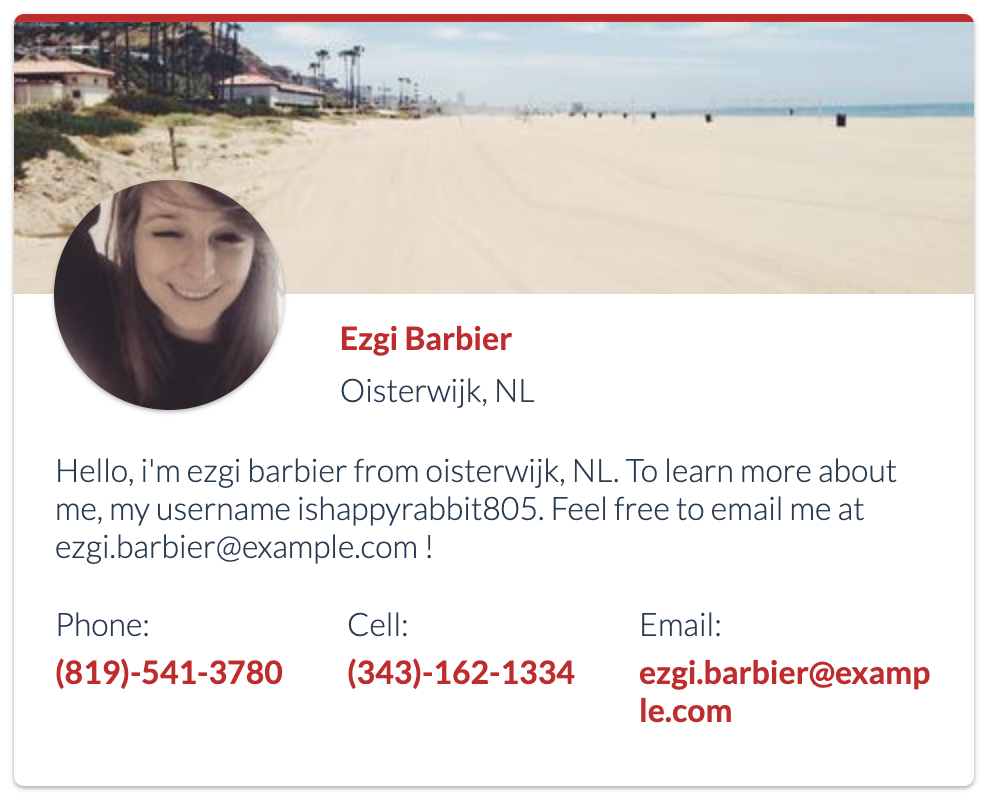

# Creating a profile card with Vanilla JS

Whether you are someone who is trying to learn JavaScript or you are simply interested in adding a profile card to your site, this article will teach you how to create one.



A profile card is a card that contains information related to a user. The profile card we will be creating will display a user's name, location, summary, phone, and email address.

In order to populate our profile card with content we will be calling the following API endpoints https://randomuser.me and https://picsum.photos.

Let's get started.

First let's create the following files:
```
profile_card/
├── index.html
├── styles.css
└── script.js
```

## HTML
Our profile card can be divided into two sections. One section will display a hero header, the other section will display the user's information.

### index.html
```html
<!DOCTYPE html>
<html>
<head>
    <meta charset="utf-8" />
    <title>Profile Card</title>
    <meta name="viewport" content="width=device-width, initial-scale=1">
    <link rel="stylesheet" type="text/css" media="screen" href="styles.css" />
</head>
<body>
    <div class="card">

        <!-- Hero header -->
        <div class="background">
            
        </div>

        <!-- User information -->
        <div class="content">
            <div class="profile">
                
            </div>
            <div class="header">
                <h2 class="name"></h2>
                <p class='location'></p>
            </div>
            <div class="info">
                <p class="description"></p>
            </div>
            <div class="labels">
                <div class="label">
                    <p>Phone:</p>
                    <h2 class="phone"></h2>
                </div>
                <div class="label">
                    <p>Cell:</p>
                    <h2 class="cell"></h2>
                </div>
                <div class="label">
                    <p>Email:</p>
                    <h2 class="email"></h2>
                </div>
            </div>
        </div>
    </div>
    <script src="script.js"></script>
</body>
</html>
```

## CSS
Now it is time to make our profile card look good. First we will import the font family Lato from google fonts. https://fonts.google.com/.

```
@import url('https://fonts.googleapis.com/css?family=Lato:300,700');
```

For the profile card's hero header, we will import an image from https://picsum.photos/. One cool thing about using this API is that it will allow us to set the dimensions of a random image depending on the path and parameters we define in the URL. For example, for our project we will need an image that is 480px by 382px. So all we have to do is: https://picsum.photos/480/382. To get a random image we simply have to append ?random to the URL. We will position the image using the `background-image` property and set `background-size` to cover so that the image leaves no white space in its' container. We will also set the `background-position` to `center` so that the image is horizontally and vertically centered.

```css
.background {
    background-image: url('https://picsum.photos/480/382/?random');
    background-size: cover;
    background-position: center;
    height: 136px;
}
```

We will also be using CSS Flexbox to align 3 elements which will contain a users' phone, cell and email address. First we will set the display property of the parent of these 3 elements (`.labels`) to `flex`.
```css
.labels {
    display: flex;
}
```
Next, we'll apply the following CSS properties to the 3 elements that are inside `.labels`.
```css
.labels .label {
    flex-grow: 1;
}
```
`flex-grow` defines how the remaining space inside `.labels` should be distributed amongst the 3 elements. By setting `flex-grow` to `1`, we are evenly distributing the remaining space inside `.labels` to each of the 3 elements.

_Learn more about CSS flexbox_: https://css-tricks.com/snippets/css/a-guide-to-flexbox/

### styles.css
```css
@import url('https://fonts.googleapis.com/css?family=Lato:300,700');

h2, p {
    font-family: 'Lato', serif;
    font-size: 16px;
}

h2 {
    color: #CF1124;
}

p {
    color: #243B53;
}

.card {
    box-shadow: 0 1px 3px rgba(0,0,0,0.12), 0 1px 2px rgba(0,0,0,0.24);
    border-radius: 5px;
    border-top: solid 4px #CF1124;
    height: 382px;
    margin: 0 auto;
    position: relative;
    width: 480px;
}

.background {
    background-image: url('https://picsum.photos/480/136/?random');
    background-size: contain;
    background-position: center;
    height: 136px;
}

.content {
    padding-top:12px;
    padding-left: 21px;
    padding-right: 21px;
}

.profile {
    position: absolute;
    top: 78.5px;
    left: 20px;
}

.profile img {
    box-shadow: 0 1px 3px rgba(0,0,0,0.12), 0 1px 2px rgba(0,0,0,0.24);
    border-radius: 50%;
    height: 115px;
}

.header {
    text-transform: capitalize;
    max-width: 190px;
    width: 35%;
    margin: 0 auto;
}

.header .name {
    margin: 0px;
}

.header .location {
    margin-top: 7px;
    margin-bottom: 0px;
}

.info { 
    margin-top: 21px;
}

.labels {
    display: flex;
    margin-top: 20px;
}

.labels .label {
    flex-grow: 1;
    word-wrap: break-word;
    width: 0;
}

.labels .label p {
    margin-bottom: 5px;
    margin-top: 0px;
}

.labels .label h2 {
    margin: 0px;
}
```

## Javascript
We are now up to the last component of our profile card. To populate our profile card with user content we will use https://randomuser.me. Randomuser is a free, open source API for generating random user data.

We will be using the Fetch API (https://developer.mozilla.org/en-US/docs/Web/API/Fetch_API) to retrieve content from the Randomuser API.

Since we are making a GET request, we only need to pass in a URL to the Fetch API. In order to retrieve data from one random user, we need to append the query parameter `results=1` to the URL.

_Randomuser.me API documentation:_ https://randomuser.me/documentation_

```javascript
fetch('https://randomuser.me/api/?results=1')
.then((resp) => resp.json())
.then((data) => {
    ProfileCard.setData(data.results[0]);
});
```

Next we need to convert the response we get back from _randomuser.me_ to JSON and finally pass that data to our module that we will create called `ProfileCard`.

```javascript
const ProfileCard = (() => {

})();
```

Within the `ProfileCard` module, we will add several selectors that target parts of our HTML that we would like to populate with text and images.

```javascript
const ProfileCard = (() => {
    const profile = document.querySelector('.profile-img');
    const name = document.querySelector('.name');
    const location = document.querySelector('.location');
    const description = document.querySelector('.description');
    const phone = document.querySelector('.phone');
    const cell = document.querySelector('.cell');
    const email = document.querySelector('.email');
})();
```

We will also add a method called `setData` to the `ProfileCard` module.

```javascript
setData: (data) => {
    let fullname = `${data.name.first} ${data.name.last}`;
    let origin = `${data.location.city}, ${data.nat}`;

    profile.src = data.picture.large;
    name.textContent = fullname;
    location.textContent = origin;
    description.textContent = `Hello, I am ${fullname} from ${origin}. To learn more about me, my username is` +
    `${data.login.username}. Feel free to email me at ${data.email} !`;
    phone.textContent = data.phone;
    cell.textContent = data.cell;
    email.textContent = data.email;
}
```

`setData` is the method that will be called when we fetch data from the _Randomuser_ API. It has a parameter called data which will be the data we get back from the API. We then use that data to populate the HTML nodes we selected.

### script.js
```javascript
const ProfileCard = (() => {
    const profile = document.querySelector('.profile-img');
    const name = document.querySelector('.name');
    const location = document.querySelector('.location');
    const description = document.querySelector('.description');
    const phone = document.querySelector('.phone');
    const cell = document.querySelector('.cell');
    const email = document.querySelector('.email');

    return {
        setData: (data) => {
            let fullname = `${data.name.first} ${data.name.last}`;
            let origin = `${data.location.city}, ${data.nat}`;
 
            profile.src = data.picture.large;
            name.textContent = fullname;
            location.textContent = origin;
            description.textContent = `Hello, I am ${fullname} from ${origin}. To learn more about me, my username is` +
            `${data.login.username}. Feel free to email me at ${data.email} !`;
            phone.textContent = data.phone;
            cell.textContent = data.cell;
            email.textContent = data.email;
        }
    }
})();

fetch('https://randomuser.me/api/?results=1')
.then((resp) => resp.json())
.then((data) => {
    ProfileCard.setData(data.results[0]);
});
```

## Done
Our profile card is now complete! Or is it? One thing we did not take into consideration when building our profile card is making it responsive. Other things you may consider modifying is the content, color and font of the profile card. Feel free to modify it to your liking!
